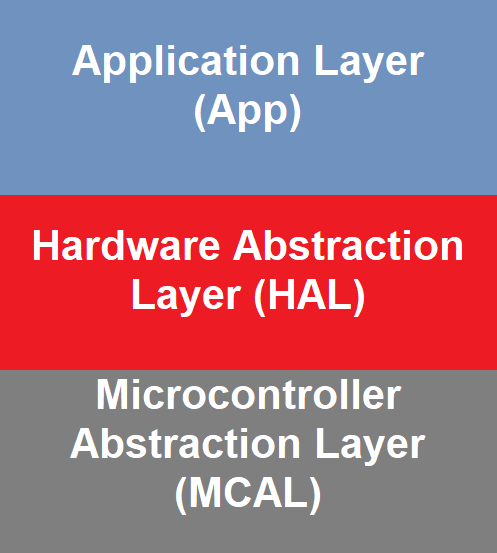
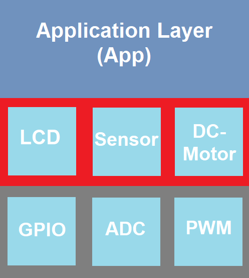
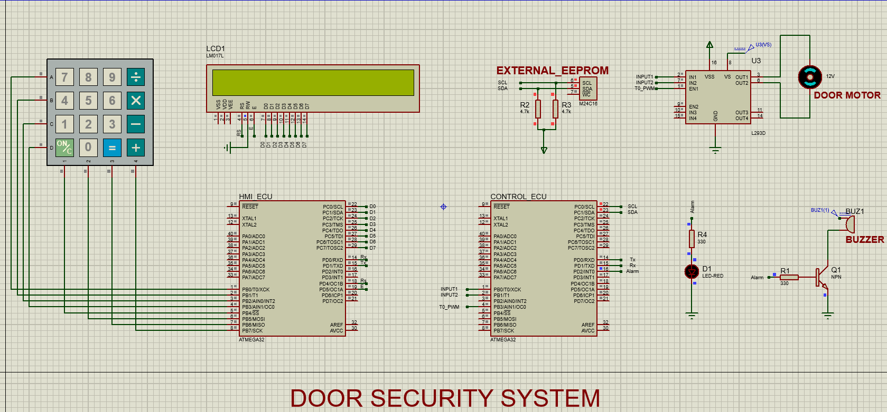

# Door_Security_System_AVR

Implemented via **AVR atmega32** MCU with **8 MHz** internal clock frequency.

>### Project Description

* **The door is unlocked using a password entered via a keypad:**
&emsp; <i>i. The door opens by rotating the DC motor Anti-clockwise for 15 seconds. 
&emsp;    ii. It is then held open for 3 seconds. 
&emsp;    iii. Then it is closed by rotating the DC motor clockwise for 15 seconds.  </i>
* **If the user entered a wrong password 3 consecutive times:**  
&emsp; <i>i. The keypad accepts no input for 1 minute. 
&emsp;    ii. A buzzer and a LED are triggered for 1 minute. 

>### Project Specifications

* **Human Machine Interface Micro-controller Unit:**     
&emsp; <i>- Responsible for interaction with the user.   
&emsp;    - System initialization: It prompts the user to enter a new password and confirm it. 
&emsp;    - It send the password input to the CONTROL ECU to be confirmed.  
&emsp;    - No input is accepted from keypad if the password is entered 3 consecutive times. </i>
* **Control Micro-controller Unit:**     

>### Project Design

* **The Project follows modular design as shown in the diagram below:**

Layered Model            |  Layered Model Detailed
:-------------------------:|:-------------------------:
  |  

>### Project Simulation

>### Hardware Implementation
* **youtube video emb.**
  
>### How to simulate

* Clone the project repo via `git clone https://github.com/0marAmr/Fan-Control-System`.
* Open command prompt in the project directory.
* Run `make compile` to compile project files.
* Open ***project_simulation*** file found in ***simulation*** directory.
* After simulating, run `make clean` to remove compilation files.
